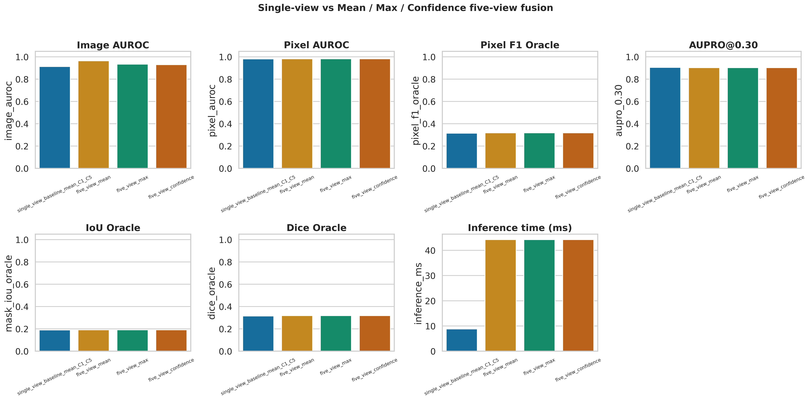
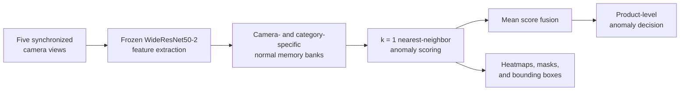
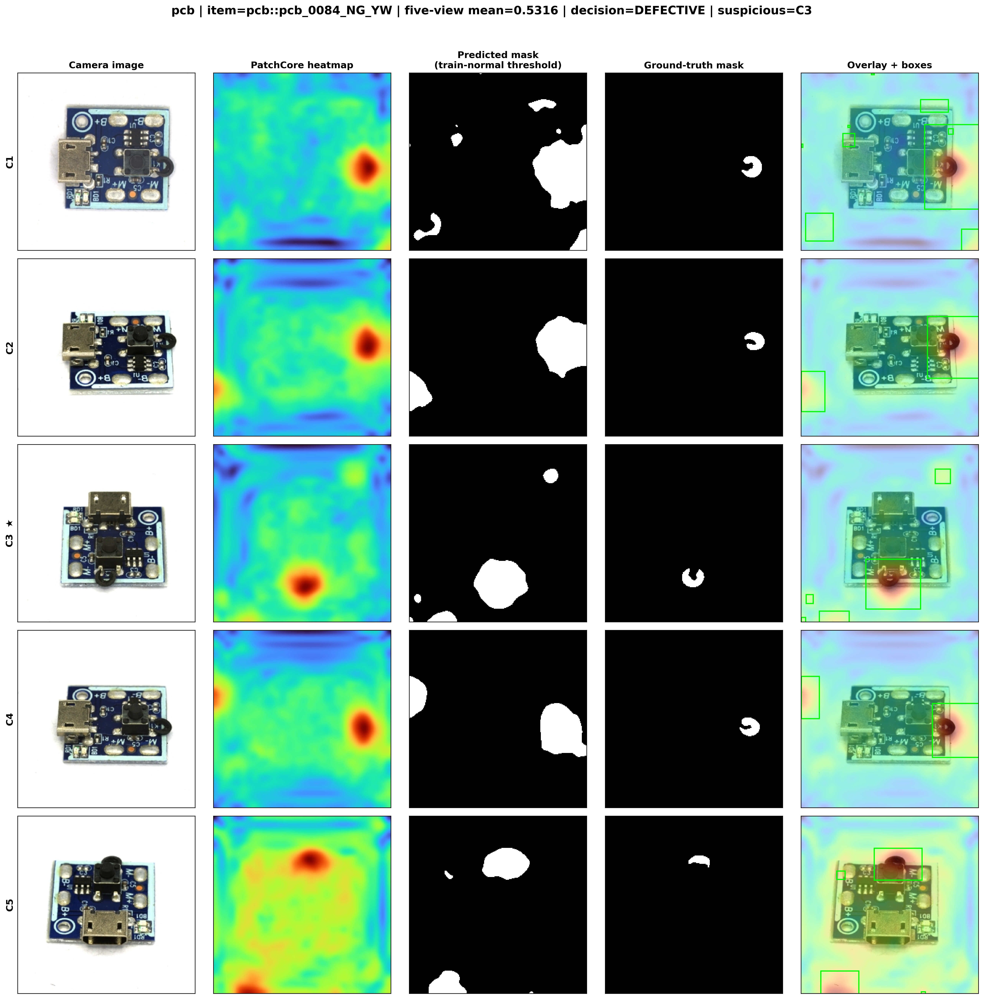

<div align="center">

# 🌸 Multi-View PatchCore for Real-IAD

### Industrial Anomaly Detection & Defect Localization Using Camera-Specific Memory Banks

[](https://www.python.org/)
[](https://pytorch.org/)
[](#methodology)
[](#dataset)
[](#research-scope-and-limitations)

<br/>

> *A multi-view industrial inspection pipeline that combines five synchronized camera perspectives for robust anomaly detection and patch-level defect localization.*

<br/>



<br/>

**✨ 96.44% Mean Image AUROC**   •   **🎯 98.27% Mean Pixel AUROC**   •   **📷 Five Synchronized Views**   •   **🧠 20 Memory Banks**

</div>

---

## ✦ Project Overview

Industrial defects may be visible from only one camera angle. This project implements a **multi-view PatchCore** pipeline on the [Real-IAD dataset](https://realiad4ad.github.io/Real-IAD/), processing five synchronized camera views (`C1`–`C5`) for each product.

Instead of mixing all viewpoints in one feature memory, the method builds independent normal-only memory banks for each camera and product category. Per-view anomaly scores are then fused into one product-level decision, while per-camera heatmaps, masks, and bounding boxes provide interpretable localization outputs.

### Evaluated Real-IAD categories

`transistor1` · `plastic_nut` · `pcb` · `terminalblock`

---

## ✨ Key Results

| Metric                 |                              Result |
| :--------------------- | ----------------------------------: |
| Mean Image AUROC       |                          **96.44%** |
| Mean Pixel AUROC       |                          **98.27%** |
| Mean Average Precision |                          **97.98%** |
| Mean Product F1 Score  |                          **95.17%** |
| Mean Product Accuracy  |                          **88.38%** |
| Mean AUPRO@0.30        |                          **90.29%** |
| Mean Inference Time    | **≈ 46.7 ms per five-view product** |

> Detection thresholds are calibrated exclusively from normal training scores; test labels are not used for threshold selection.

---

## 🔬 Methodology



### Camera-specific PatchCore memory banks

The pipeline uses:

* Frozen **WideResNet50-2** feature extraction
* **20 independent memory banks**: 4 product categories × 5 camera views
* Normal training images only
* Coreset-reduced patch embeddings
* Exact L2 nearest-neighbor anomaly scoring (`k = 1`)
* Robust per-view score calibration
* Mean fusion for the final five-view decision

This camera-specific design avoids conflating distinct product perspectives and allows each view to preserve its own normal visual distribution.

---

## 📈 Multi-View Ablation

A camera-combination study spanning 13 view subsets shows that performance increases as more visual coverage is available.

| Number of views | Mean Image AUROC |
| :-------------: | ---------------: |
|        1        |           91.32% |
|        2        |           94.75% |
|        3        |           95.43% |
|        4        |           96.37% |
|        5        |       **96.44%** |

The result supports the central idea of the project: defects can be weak or invisible in one view but salient in another, so multi-view inspection provides a more reliable product-level assessment.

---

## 🧩 Qualitative Defect Localization

This PCB example demonstrates five-view localization. Each row represents a synchronized camera view, while the columns show the original image, PatchCore heatmap, predicted mask, ground-truth mask, and heatmap-overlay bounding boxes.



More qualitative examples for `transistor1`, `plastic_nut`, and `terminalblock`, as well as all experimental plots, are available here:

<p align="center">

### → [Browse all project figures](figures/) ←

</p>

---

## 🧪 Exploratory Vision-Language Baseline

A zero-shot CLIP experiment was evaluated as an exploratory baseline. CLIP-only scoring achieved **56.53% mean Image AUROC**, and PatchCore–CLIP fusion did not improve over the multi-view PatchCore system.

For this reason, the vision-language experiment is reported transparently as exploratory work rather than the main contribution. The core contribution remains the **camera-specific multi-view PatchCore pipeline**.

---

## 📁 Repository Structure

```text
multiview-patchcore-realiad/
├── assets/                         # README visuals
│   ├── fusion_and_single_view_full_comparison.png
│   └── multiview_localization_pcb.png
├── figures/                        # Full qualitative and quantitative results
├── tables/                         # Exported evaluation tables
├── MV_PatchCore.ipynb              # Complete Colab/Jupyter pipeline
├── README.md
└── .gitignore
```

---

## 💻 Running the Project

1. Clone the repository.

   ```bash
   git clone https://github.com/aynazsafari/multiview-patchcore-realiad.git
   cd multiview-patchcore-realiad
   ```

2. Obtain Real-IAD from its official source.

3. Open [`MV_PatchCore.ipynb`](MV_PatchCore.ipynb) in Google Colab or Jupyter Notebook.

4. Update the dataset root path in the configuration cell, then run the notebook cells in order.

The raw dataset, model weights, and large intermediate artifacts are deliberately excluded from this repository.

---

## 📦 Dataset

This project uses the **Real-IAD** industrial anomaly-detection benchmark.

* Five synchronized camera views for each product: `C1`–`C5`
* Four evaluated categories from the 30-category benchmark
* One-class training protocol: normal product images only
* Official source: [Real-IAD project page](https://realiad4ad.github.io/Real-IAD/)

---

## ⚠️ Research Scope and Limitations

* The current study evaluates **4 of 30 Real-IAD categories**. The selected subset includes diverse product geometries and defect types within the available computational budget.
* The published Real-IAD PatchCore reference result uses a different evaluation scope—30 categories and a single-view protocol—therefore it is contextual background and **not a directly comparable per-category baseline**.
* Patch-level anomaly maps can produce coarser masks than fully supervised segmentation.
* The approach uses score-level fusion and does not yet model explicit 3D geometry or cross-view spatial correspondence.

---

## 📚 Citation

This research implementation is currently being prepared for submission. If you use this repository, please cite it as:

```text
A. Safari, “Multi-View PatchCore for Real-IAD:
Industrial Anomaly Detection and Defect Localization
Using Camera-Specific Memory Banks,” 2026.
```

---

<div align="center">

Built with PyTorch, PatchCore, and Real-IAD.
Made for transparent and reproducible industrial inspection research. 🌷

</div>
